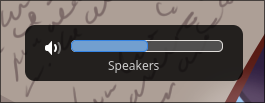

# Wayland OSD



A lightweight On-Screen Display (OSD) system for Wayland compositors. This project provides a client-server architecture for displaying various system notifications like volume changes, brightness adjustments, and keyboard state indicators.

The motivation behind this project is that all of the OSDs that were available were coupled way too tightly with particular tools for tracking system state like `pactl`.

Wob is almost there but not quite for me as it's not as visually pretty for me.

## Components

- **wayland-osd-server**: A GTK4-based server that handles the actual display of OSD elements using Wayland's layer shell protocol
- **wayland-osd-client**: A command-line client for sending OSD requests to the server
- **wayland-osd-wireplumber-monitor**: A WirePlumber-based monitor for audio events

## Features

- Modern GTK4-based UI with layer shell support
- Supports various system indicators:
  - Audio volume (with mute state)
  - Display brightness
  - Keyboard state (Caps Lock, Num Lock, Scroll Lock)
- Client-server architecture for easy integration with system tools
- Includes SVG icons for different states and levels

## Installation

### Building from Source

1. Ensure you have the following dependencies installed:

- Rust toolchain
- GTK4 development files
- GTK Layer Shell
- WirePlumber development files (wireplumber-0.5)
- C compiler with C23 support
- make

2. Build and install the components:

```bash
# Build and install the client and server
cargo install --path ./wayland-osd-client
cargo install --path ./wayland-osd-server

# Build and install the wireplumber monitor
cd wayland-osd-wireplumber-monitor
make
# now move the exported file to whatever
```

3. Start service in startup script:

This uses the Hyprland configuration as an example:

```conf
exec-once = $HOME/.cargo/bin/wayland-osd-server
exec-once = path-to-monitor/wayland-osd-wireplumber-monitor $HOME/.cargo/bin/wayland-osd-client
```

## Usage

1. Start the server:

```bash
wayland-osd-server
```

2. Use the client to display notifications:

```bash
# Display volume level
wayland-osd-client audio 75

# Display muted state
wayland-osd-client audio --mute 75

# Display brightness
wayland-osd-client brightness 80
```

## Todo

- [ ] Customizable CSS
- [ ] Brightness
- [ ] Caps Lock

## Inspired By

- [SwayOSD: A GTK based on screen display for keyboard shortcuts like caps-lock and volume ](https://github.com/ErikReider/SwayOSD)
- [Wob: A lightweight overlay volume/backlight/progress/anything bar for Wayland. ](https://github.com/francma/wob)

## License

MIT License
